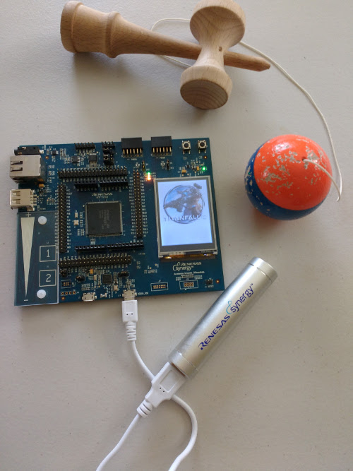
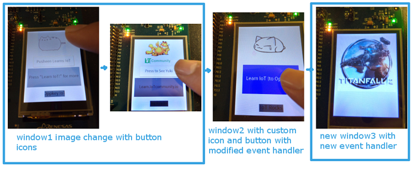

Simple tutorial from learn.iotcommunity.io to introduce people to the Renesas Synergy platform.
Uses an SK-S7G2 board, Renesas e2 Studio, and GUIX Studio. All the tools are freely available. The board 
can be purchased on [ARROW](https://www.arrow.com/en/products/yssks7g2e30/renesas-electronics).

This is an extension of the [SK-S7G2 GUIX "Hello World" - Application Project](https://www.renesas.com/en-us/software/D6000622.html)
This is for [Quick Tutorial: Customizing GUI Event Handler](http://learn.iotcommunity.io/t/quick-tutorial-customizing-gui-event-handler/585)

## Previous Tutorials

* [Quick Tutorial: Garfield Pixmap on S7G2](http://learn.iotcommunity.io/t/quick-tutorial-garfield-pixmap-on-s7g2/578?u=craig)
* [Quick Tutorial: Custom Pixelmaps on S7G2](http://learn.iotcommunity.io/t/quick-tutorial-custom-pixelmaps-on-s7g2/580?u=craig)
* [Download and Use Free Icons, Sounds, Image and Sound Editors](http://learn.iotcommunity.io/t/download-and-use-free-icons-sounds-image-and-sound-editors/594?u=craig)

## Version Information

* SSP 1.1.0
* e2 Studio 5.2.0